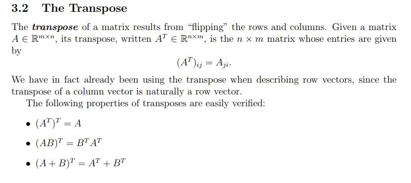

# Assignment 4


## Part 1

[Review the Git, Github and PyCharm from this link. There is a youtube video oat the end ](https://github.com/jmatai/python_for_kids/blob/main/Assignments/Meeting3_Supplemental.pptx.pdf)


## Part 2

The goal of this assignment is to esign a Vector (let us name it SuperVector class) class in python that can add, subtract and multiply vectors of **any size**. For example, the Vector class from Part 1 only works for vector sizes of 3. Use the Vector class from Part 1 if necessary.   


```python
v1 = SuperVector([1, 2, 3])
v2 = SuperVector([4, 5, 6])

print(v1 + v2)      # Output: Vector([5, 7, 9])
print(v1 - v2)      # Output: Vector([-3, -3, -3])
print(v1 * v2)      # Output: 32

```

Or it can also take vector of size 4, and us the same class to calculate add, subtract or multiply as follows. 

```python
v1 = SuperVector([1, 2, 3, 100])
v2 = SuperVector([4, 5, 6, 100])

print(v1 + v2)      # Output: Vector([5, 7, 9, 200])
print(v1 - v2)      # Output: Vector([-3, -3, -3, 0])
print(v1 * v2)      # Output: 10032

```


Here is and example SuperVector class, but **the problem with this class is that it can only add vectors of size exactly 3**. So Your taks is to improve this class so that we can (as above) use SuperVector class for **any size vectors such as v1 = SuperVector([1, 2, 3, 100]) or v1 = SuperVector([1, 2, 3])**. 

```python
class Vector:
    def __init__(self, x, y, z):
        self.x = x
        self.y = y
        self.z = z
    
    def add(self, other):
        return Vector(self.x + other.x, self.y + other.y, self.z + other.z)
    
    def subtract(self, other):
        return Vector(self.x - other.x, self.y - other.y, self.z - other.z)
    
    def multiply(self, scalar):
        return Vector(self.x * scalar, self.y * scalar, self.z * scalar)
    
    def __str__(self):
        return f"({self.x}, {self.y}, {self.z})"

```

## Part 3 (Optional) 

Write a python function that takes a matric of size N by M, and returns the transpose of the matrix. 
[Review the matrix transpose from this link. Section 3.2 The Trapose] (https://www.cs.cmu.edu/~zkolter/course/15-884/linalg-review.pdf)


