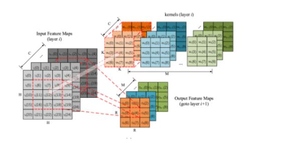
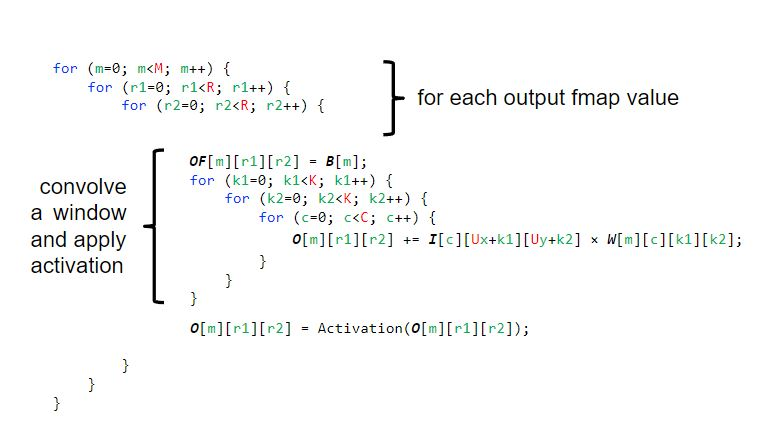

# PyTorch and Convolution 


## Part 1: PyTorch Getting Started  

Read about pytorch from 
- https://pytorch.org/tutorials/beginner/introyt.html


Especially, watch youtube videos 
- Introduction to PyTorch
- Introduction to PyTorch Tensors

## Part 2: PyTorch Installation
Read about pytorch installation from here: https://www.youtube.com/watch?v=EMXfZB8FVUA
If you could not install, we are going to install it together (so do not have to spend time if is difficult)


## Part 3: Convolutional Neural Networks


Here's an image of a drag racer in action:




Design and implement convoltion for above picture or with following parameters:
- Your input is 3D (HxWxC) where H is the height, W is the width and C is the number of channels 
- You have M kernels where each kernel size is 3x3xC 
- Your output should be RxRxM dimension  


```python
N = 4
M = 4  
K = 6

x =  np.random.rand(N,M)
y =  np.random.rand(M,K)

# Write code that multiplies x and y below 


```